# Learn
Create a database.

```
CREATE DATABASE test;
```

Check all of the available databases to the user.

```
SELECT * FROM system.databases;
```

Change database: `USE db;`

test datasample:
- [crypto prices dataset](https://learnclickhouse.s3.us-east-2.amazonaws.com/datasets/crypto_prices.parquet)
- [List of Other Datasets](https://clickhouse.com/docs/en/getting-started/example-datasets)

here is a handy function named **_formatReadableQuantity_** that makes it  
easier to view large numbers. Pass the **_count()_** function into   
**_formatReadableQuantity_** to see how it works.

Creating Table:
```
CREATE TABLE pypi (
	TIMESTAMP DateTime64,
	COUNTRY_CODE String,
	URL String,
	PROJECT String
)

ENGINE = MergeTree()
PRIMARY KEY (TIMESTAMP)
;
```

Inserting:
```
INSERT INTO pypi(TIMESTAMP, COUNTRY_CODE, URL, PROJECT)

SELECT TIMESTAMP, COUNTRY_CODE, URL, PROJECT
FROM s3('https://datasets-documentation.s3.eu-west-3.amazonaws.com/pypi/2023/pypi_0_7_34.snappy.parquet')
;
```

Show storage info about table:
```
SELECT
    formatReadableSize(sum(data_compressed_bytes)) AS compressed_size,
    formatReadableSize(sum(data_uncompressed_bytes)) AS uncompressed_size,
    count() AS num_of_active_parts
FROM system.parts
WHERE (active = 1) AND (table = 'pypi');
```

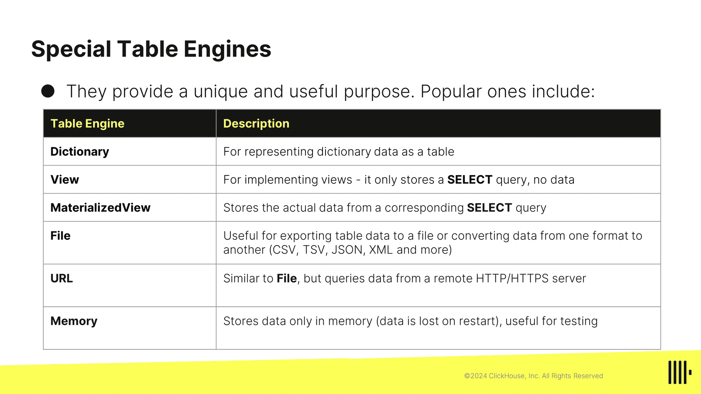
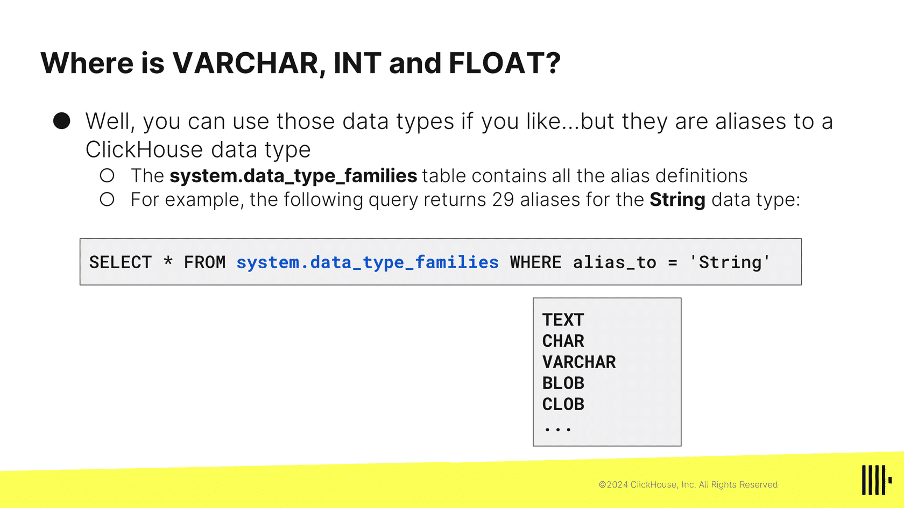
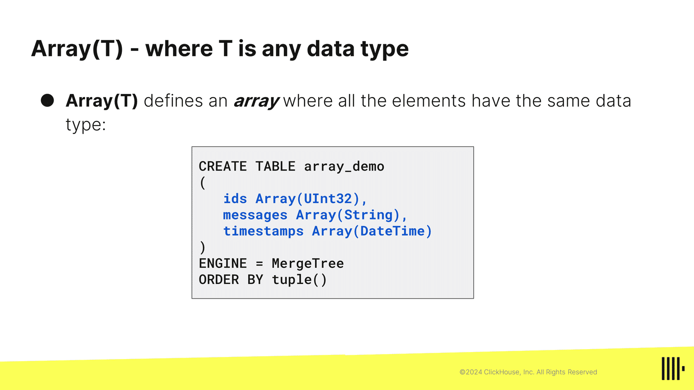
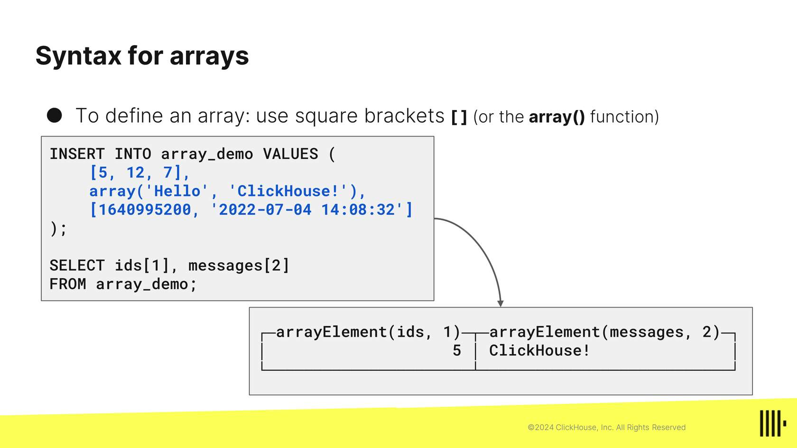
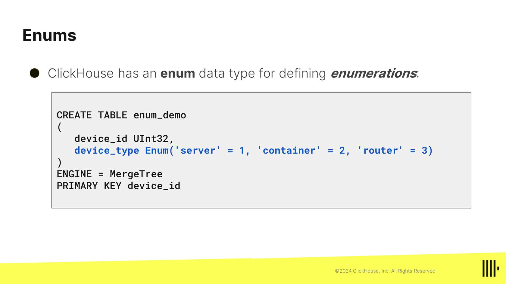
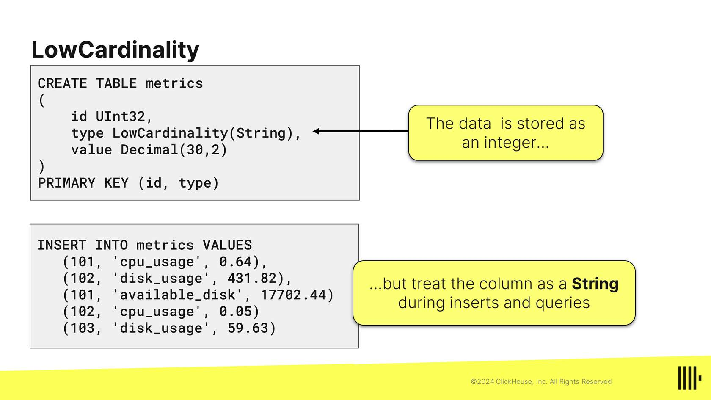

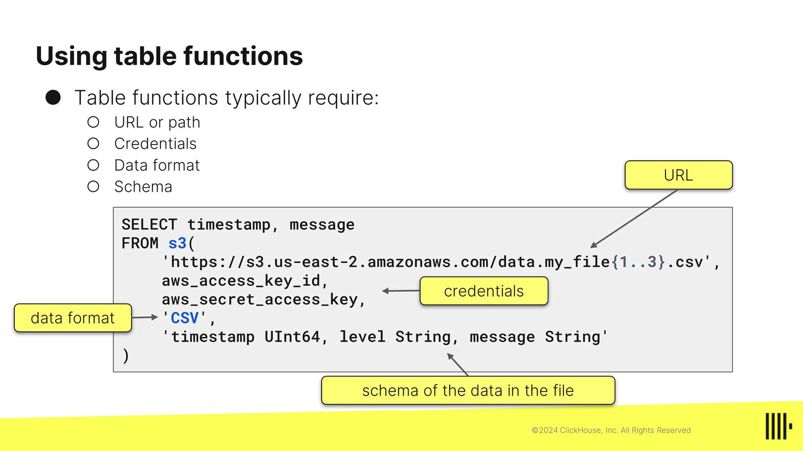
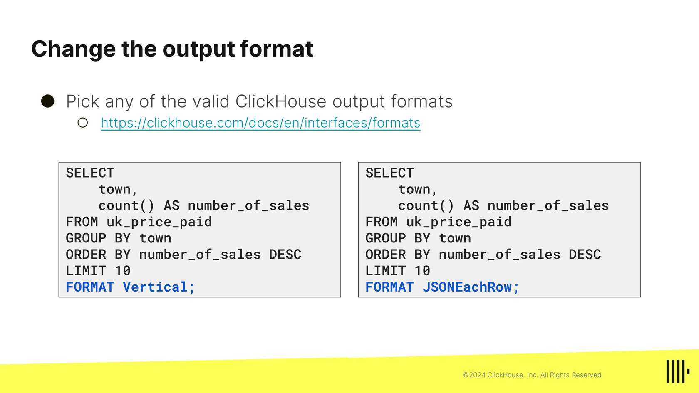
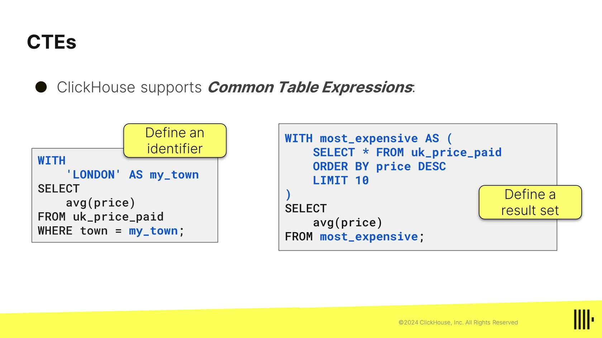


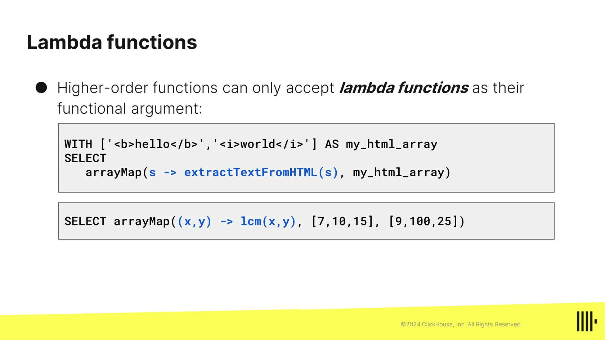
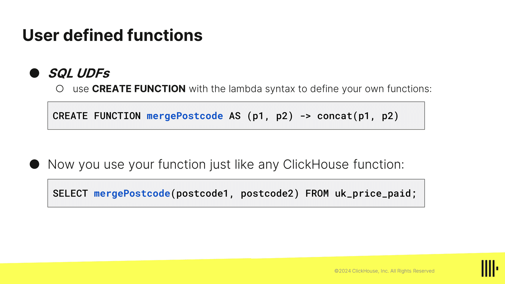
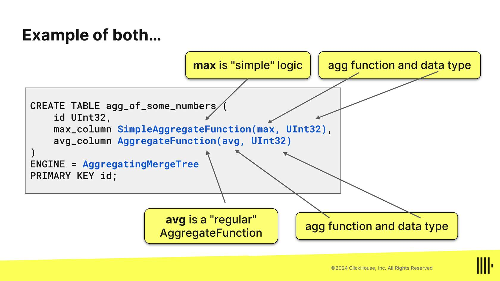
